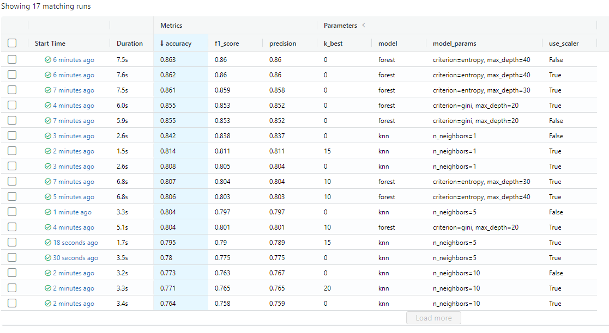
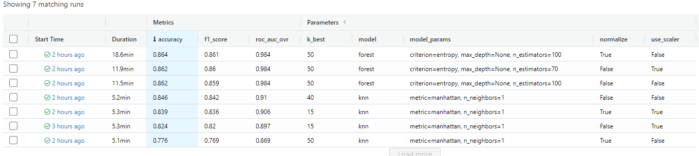

Capstone project for RS School Machine Learning course.

This project uses [Forest Cover Type Prediction](https://www.kaggle.com/competitions/forest-cover-type-prediction) dataset.

## Usage
This package allows you to train model for detecting the presence of heart disease in the patient.
1. Clone this repository to your machine.
2. Download [Forest Cover Type Prediction](https://www.kaggle.com/competitions/forest-cover-type-prediction) 
dataset, save csv locally (default path is *data/* in repository's root). 
The project only needs the `train.csv` and `test.csv`(for prediction only) tables.
3. Make sure Python 3.9 (I use [Python 3.9.12](https://www.python.org/downloads/release/python-3912/)) 
and [Poetry](https://python-poetry.org/docs/) are installed on your machine (I use Poetry 1.1.13).
4. Install the project dependencies (*run this and following commands in a terminal, 
5. from the root of a cloned repository*):
```sh
poetry install --no-dev
```
6. Run train with the following command:
```sh
poetry run train
```
Or if you need to manually define the dataset path and the model saving path:
```sh
poetry run train -d <path to csv with data> -s <path to save trained model>
```
You can configure additional options (such as hyperparameters) in the CLI. 
To get a full list of them, use help:
```sh
poetry run train --help
```
For more information, see the **scripts** section.
7. Run MLflow UI to see the information about experiments you conducted:
```sh
poetry run mlflow ui
```

## Development

## Scrips

1. In order to make a report using pandas_profiling you need to execute:
```sh
poetry run profile_data
```
The command creates a data profile in the specified directory in the format 
'profile_{name}_{suffix}.html'. This command has the following options:

`-d`/`--dataset-path` - path to dataset (default: data/train.csv).

`-o`/`--output_dir` - path to save profile in output directory (default: data/profiles).
If directory not exists - directory will be created.

2. For train model manually:
```sh
poetry run train
```
This command has the following options:

`-d`/`--dataset-path` - path to dataset (default: data/train.csv).

`-s`/`--save-model-path` - path to save the model (default: data\model.joblib).

`--random-state` - random state for model elements (default: 42)

`--k-folds` - n splits for KFolds (default: 5)

`--parallel` - it's a flag. If specified in sklearn objects 
(if possible) pass kwarg n_jobs=-1 otherwise n_jobs=None

`-m`/`--model` - selected model (default: knn, possible options: {knn, forest}).
'knn' is a `KNeighborsClassifier`, 'forest' is a `RandomForestClassifier`.

`--model-kw` - hyperparameter for a model. The command can be entered several times.
The command requires 3 arguments in the format `PARAMETER_NAME VALUE_TYPE VALUE` 
(for example: `--model-kw n_neighbors int 5`/`--model-kw metric str minkowski`)

`--scale` - it's a flag. If specified add scaler to the pipeline.

`--scaler` - scaler for pipeline (default: standard, possible options: {standard, minmax}).
'standard' is a `StandardScaler`, 'minmax' is a `MinMaxScaler`.

`--normalize` - it's a flag. If specified add `Normalizer` to the pipeline.

`--k-best` - k parameter for `SelectKBest` (default: 0). If it is zero - 
`SelectKBest` will not be included in the pipeline.

`--save-cfg` - it's a flag. If specified save config file with train parameters.
(see `train_by_cfg` command)

`--cfg-path` - path to save config (default: data\model_settings.ini).

3. For train the model with parameters from config file:
```sh
poetry run train_by_cfg
```
This command has the following options:

`--cfg-path` - path to save config (default: data\model_settings.ini).

Config file has two optional sections - `general` and `model_kw`.

In `general` section format is `PARAM = VALUE`. parameter name is 
the same as the name of the entry in the console of the full option name, 
only without the '--' at the beginning and with '-' replaced by '_'. 
Flags are written in the same way as for a boolean value. Example:
```
[general]
dataset_path = data\train.csv
save_model_path = data\model.joblib
random_state = 42
k_folds = 5
parallel = False
scale = True
scaler = standard
normalize = False
k_best = 15
model = knn
```
`model_kw` is the section with a hyperparameters for a model. In this 
section format is `PARAMETER_NAME = VALUE_TYPE VALUE`. Example:
```
[model_kw]
n_neighbors = int 5
metric = str minkowski
```
4. To find the hyperparameters of the model in semi-automatic mode:
```sh
poetry run find_best
```
This command has the following options:

`-d`/`--dataset-path` - path to dataset (default: data/train.csv).

`-s`/`--save-model-path` - path to save the model (default: data\best_model.joblib).

`--random-state` - random state for model elements (default: 42)

`-m`/`--model` - selected model (default: knn, possible options: {knn, forest}).
'knn' is a `KNeighborsClassifier`, 'forest' is a `RandomForestClassifier`.

`--scale` - it's a flag. If specified add scaler to the pipeline.

`--scaler` - scaler for pipeline (default: standard, possible options: {standard, minmax}).
'standard' is a `StandardScaler`, 'minmax' is a `MinMaxScaler`.

`--normalize` - it's a flag. If specified add `Normalizer` to the pipeline.

`--n-jobs` - the number of processes to run the script in parallel.

## Checks
1. Screenshot from `mlflow iu` with three different sets of hyperparameters, two different feature engineering techniques, and two different ML models.

2. Screenshot from `mlflow iu` with result by `find_best` command.
